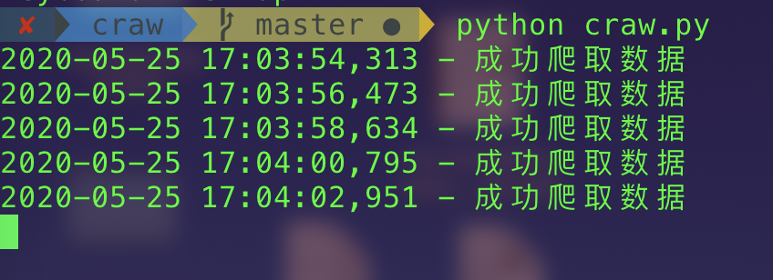
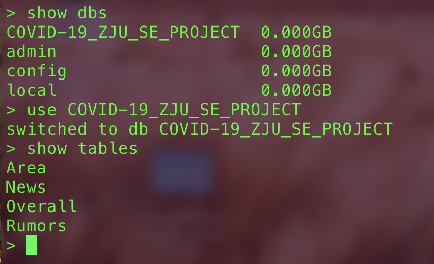
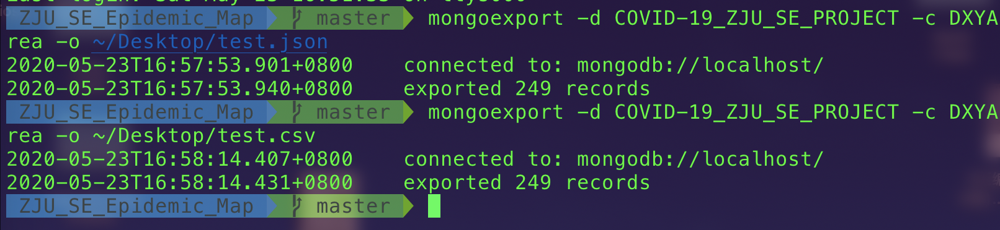
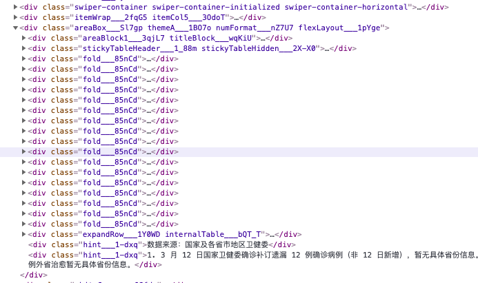
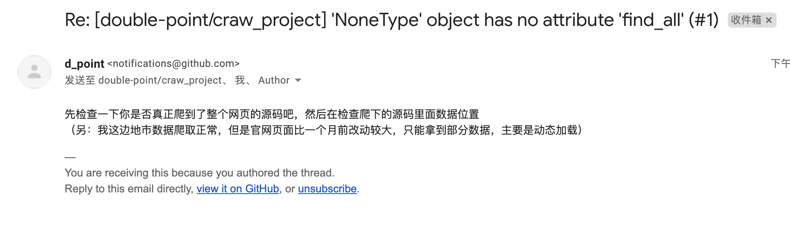

# ZJU_SE_Epidemic_Map


我的部分是写爬虫代码，从丁香园爬取疫情数据，并且把数据放在本地的mongo数据库中。

代码中设定每2s更新一次数据。数据库中的数据可以导出为json和csv。相关代码在src/中

* 运行环境：

  MacOS 10.15.4 Catalina

* 环境配置：

```
pip install -r requirements.txt
```

* 运行：

```
python src/craw.py
```

* 测试结果



* 查看mongo数据库：

  其中我创建的COVID-19_ZJU_SE_PROJECT数据库

  

  

* 数据导出：

```
mongoexport -d COVID-19_ZJU_SE_PROJECT -c Overall -o ~/Desktop/test_Overall.json

mongoexport -d COVID-19_ZJU_SE_PROJECT -c Overall -o ~/Desktop/test_Overall.csv
```




本项目的代码设计主要参考了https://github.com/BlankerL/DXY-COVID-19-Data，感谢项目原作者对疫情数据处理的贡献


#### 参考：

* Mongo数据库的下载和使用：https://segmentfault.com/a/1190000020400235

* [可用的爬取源（国外）](https://github.com/CSSEGISandData/COVID-19)
* [可用的爬取源（国内）](https://github.com/BlankerL/DXY-COVID-19-Data)
* [写代码参考教程](https://blog.csdn.net/Eastmount/article/details/104995419)，代码在Wuhan-data-analysis-master中，写的很详细
* [从网页找到URL，并且爬取到excel的教程（国外）](https://blog.csdn.net/sxt1001/article/details/105102919?utm_medium=distribute.pc_relevant.none-task-blog-BlogCommendFromMachineLearnPai2-3.nonecase&depth_1-utm_source=distribute.pc_relevant.none-task-blog-BlogCommendFromMachineLearnPai2-3.nonecase)
* [从网页找到URL，并且爬取到excel的教程（国内）](https://blog.csdn.net/sxt1001/article/details/105230277)
* [爬虫，热力图，自动发邮件](https://juejin.im/post/5e4774a4f265da572b7667e3)
* https://my.oschina.net/u/4339087/blog/3306137
* [疫情爬虫教程](https://zhuanlan.zhihu.com/p/118632394)


# 下面是写给我自己的

rumor的json格式需要手动修改：

用result [ ] 括起来，每行用 ， 隔开


# 下面的是之前制作代码的一些记录，文档的同学可以不用看


### 爬虫设计+数据集：

* 主要参考craw_NCP/文件里面的内容，注意chromedriver的位置

* 目前遇到的问题：网页数据的抓取有问题，可能需要动态抓取



找了半天终于找到国内的class，但是更新class之后还是有bug



### 如何运行：

进入craw文件夹：

```
cd craw_NCP/
```

运行程序：

```
python main_ncp.py
```


### 目前使用的爬虫源：

* [可用的爬取源（国外）](https://github.com/CSSEGISandData/COVID-19)
* [可用的爬取源（国内）](https://github.com/BlankerL/DXY-COVID-19-Data)
* [写代码参考教程](https://blog.csdn.net/Eastmount/article/details/104995419)，代码在Wuhan-data-analysis-master中，写的很详细


### 后端设计参考

https://blog.csdn.net/qq_41306364/article/details/104198760
（有下载的包，但是要积分

里面提到了一些前后端的框架和MVC的理解
https://www.zhihu.com/question/286165126


### Python 爬取参考

* [从网页找到URL，并且爬取到excel的教程（国外）](https://blog.csdn.net/sxt1001/article/details/105102919?utm_medium=distribute.pc_relevant.none-task-blog-BlogCommendFromMachineLearnPai2-3.nonecase&depth_1-utm_source=distribute.pc_relevant.none-task-blog-BlogCommendFromMachineLearnPai2-3.nonecase)
* [从网页找到URL，并且爬取到excel的教程（国内）](https://blog.csdn.net/sxt1001/article/details/105230277)
* [爬虫，热力图，自动发邮件](https://juejin.im/post/5e4774a4f265da572b7667e3)
* https://my.oschina.net/u/4339087/blog/3306137
* [疫情爬虫教程](https://zhuanlan.zhihu.com/p/118632394)


### Django相关
https://www.cnblogs.com/wangyayun/p/6617351.html

youtube教程
https://www.youtube.com/watch?v=F5mRW0jo-U4


## Mongo 的使用
参考：https://www.jianshu.com/p/22d0ae3c3575

1. 查看数据：
```
mongo
```

2. 导出数据
```
mongoexport -d 2019-nCoV -c DXYArea -o ~/Desktop/test.json
```


